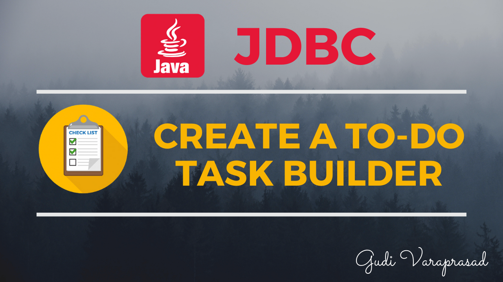
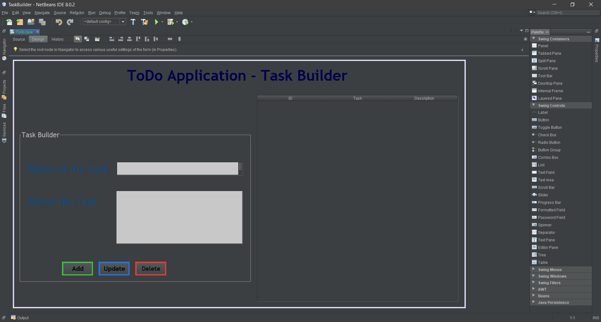
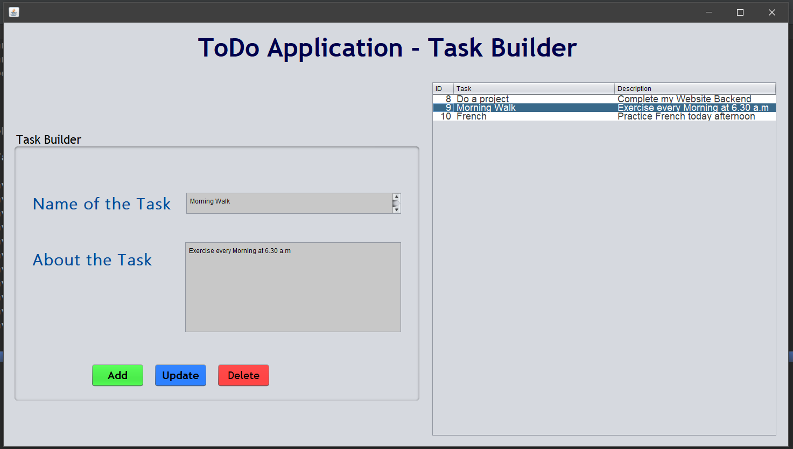
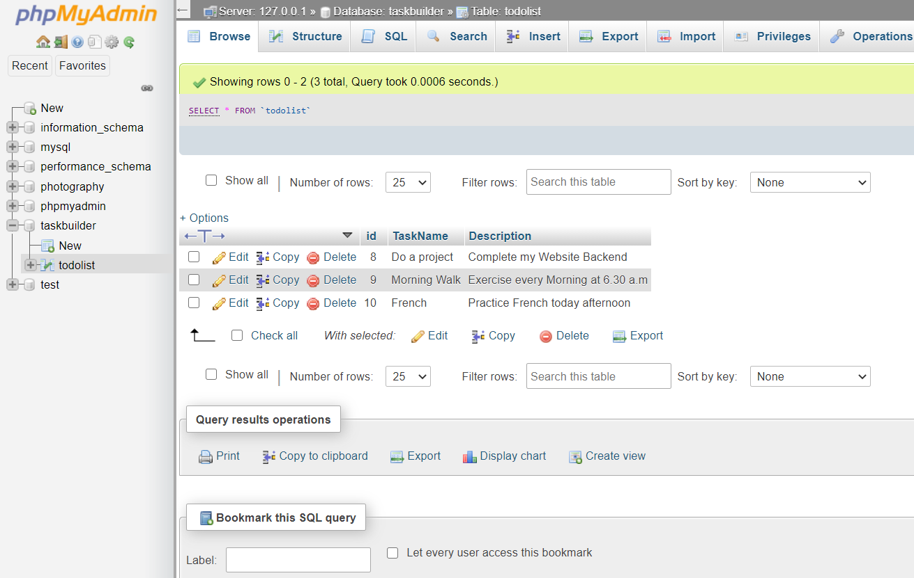

# ToDo JAVA Application  -  The ultimate Task Builder | JDBC NetBeans Project

This is simple JAVA GUI application with Database Connectivity which helps user to maintain his tasks list. It helps to easily organize and prioritize your tasks and projects so you’ll always know exactly what to work on next.

[Learn More - Try a demo here](https://youtu.be/0ZspDM2Dcfc)

## Design of GUI

## Application

## Database Connectivity

